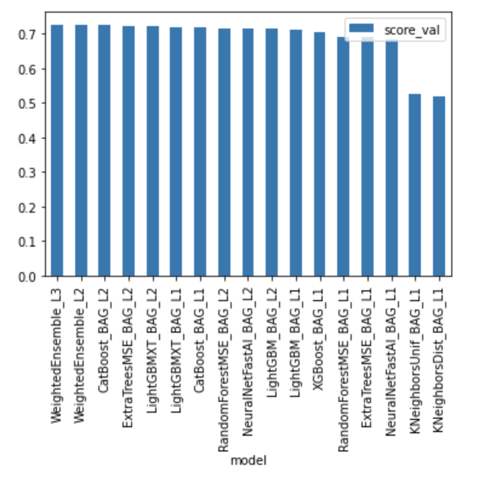
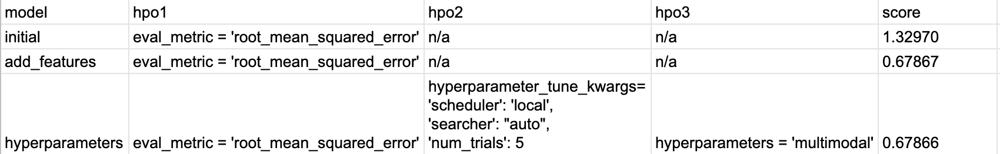
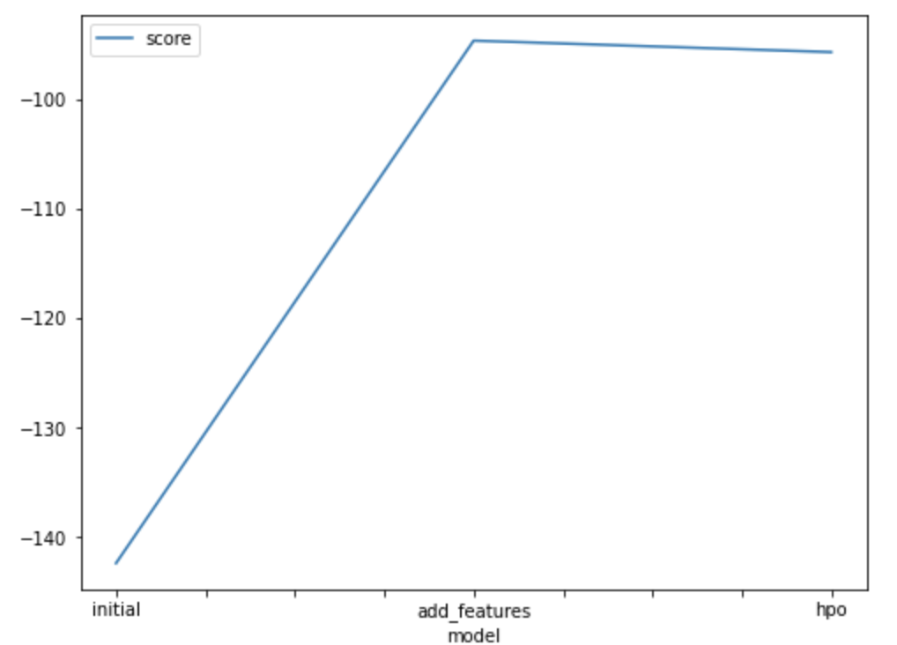
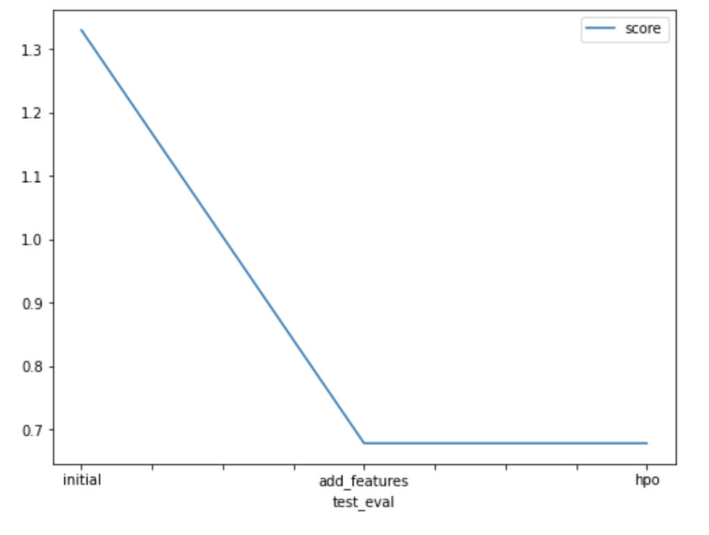

# Report: Predict Bike Sharing Demand with AutoGluon Solution
#### Wiktoria Twarog

## Initial Training
### What did you realize when you tried to submit your predictions? What changes were needed to the output of the predictor to submit your results?
First time I submitted predictions I realized that including "datetime" column as a feature is not efficient as dates are "unique" for each record. Because of this my first submission score on Kaggle  was very high: 1.78354. After removing "datetime" column from features, the score dropped to: 1.33244. I understood this is the feature that needs to be used to create additional feature.

### What was the top ranked model that performed?
After training a model using AutoGluon’s Tabular Prediction it appears that the best model for this problem is WeightedEnsemble_L3. The score value is the highest one.

[leaderboard_1st_submission.png](img/leaderboard_1st_submission.png)

## Exploratory data analysis and feature creation
### What did the exploratory analysis find and how did you add additional features?
Creating histograms shows the distribution of each one relative to the data.
I've created additional feature by changing "datetime" column to datetime format, and then I've added new column that includes only an hour.

### How much better did your model preform after adding additional features and why do you think that is?

After adding new feature, still the best model was WeightedEnsemble_L3.  Score value in this case was: -94.640347.

[leaderboard_new_features.png](img/leaderboard_new_features.png)

Adding the feature such as hour was a significant change, as an hour has a huge impact on how many bicycles are rented so this feature is very important.
I think this is much better visible how model performed by compering Kaggle score shown in the last plot.

## Hyper parameter tuning
### How much better did your model preform after trying different hyper parameters?

After hyperparameters change model's best score was 0.726864 - the value significantly changed after changing parameter eval_metric to "r2", but looking at the Kaggle score it didn't change accuracy of the model.

### If you were given more time with this dataset, where do you think you would spend more time?
First of all, I would spend more time exploring the data. For example, I would check if there aren't any extreme values that could be just incorrect measurement. I would also make more plots using training data to check how each feature affects the target values.
Also, I would add additional features like weekday as this could also upgrade the final model.

I would also change other hyperparameters to see which will be the best for this project.

### Create a table with the models you ran, the hyperparameters modified, and the kaggle score.

### Create a line plot showing the top model score for the three (or more) training runs during the project.

### Create a line plot showing the top kaggle score for the three (or more) prediction submissions during the project.

## Summary
This is a great project, that helped me understand how adding new features or changing them can significantly change the model. This is great dataset to have a better understanding of machine learning basics.
I have some ideas how to improve the score - I will add additional feature weekday and also make some simplifications like categorization some of the features. Plus after additional analysis I would remove those which are not needed.
